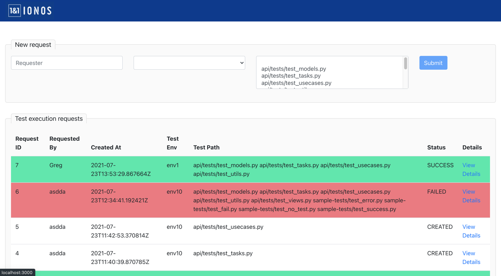
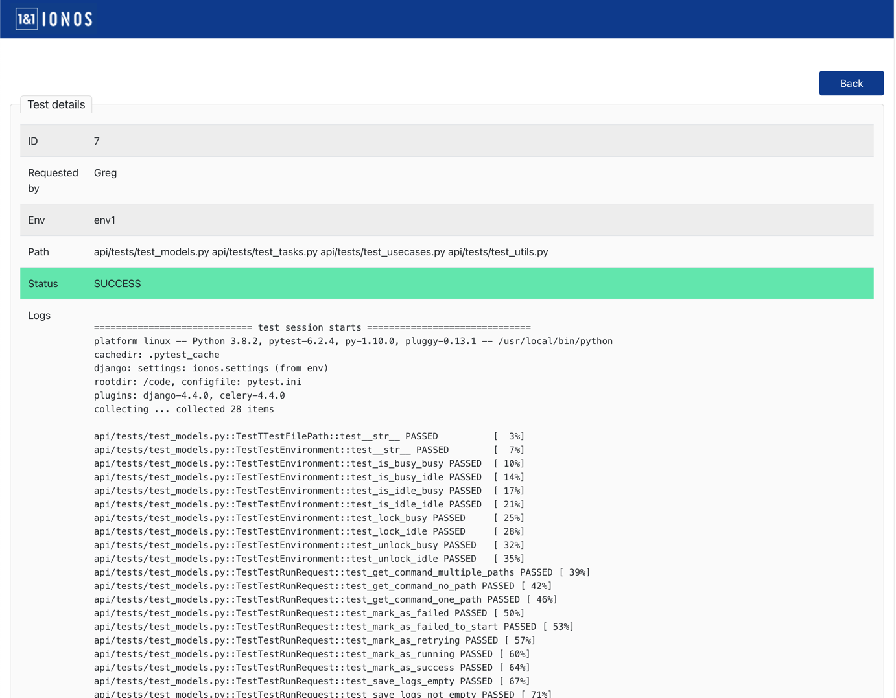

## DCM Technical Task: Test runner web application
This is an API that provides a central place to run Python-based tests.
These tests run in a shared environment.

There are some sample tests (some failing, some not,
and some that have delays for more realism) and the tests for this application can also be run in the runner.
The tests are executed on the machine that hosts the test executor application.

###################################

### Task Description:

Please implement an SPA frontend for this API.  All the documentation for the API can be found 
at http://localhost:8081/api/v1/schema/swagger once the API containers are running.

Requirements:

* A table for showing past test runs that updates dynamically as tests pass / fail
* When a test is chosen from the table you can see the logs from the test to see what went wrong or right
* Some testing for DOM rendering / workflow for the SPA (It's not needed to have full coverage just show us how you'd 
start testing a project like this)
* Validations for the form to run a test

Here is an example of what the table and detail could look like



###################################

### After implementing the frontend, make sure that the following works properly:
* Creating a new test run with the following:
    * Username
    * Test environment ID (choose an ID between 1 and 100)
    * Choosing one or more files to test (the available tests are read from file system)
       
* List all previous test runs in a table including their outcome (failed, success,
running)

* List details for one test run
    * Show username, test env ID and what was tested
    * Show the full log that the test created


## How to run the current project locally
```
cp /ionos/.env.dist /ionos/.env
docker-compose build
docker-compose up
```
You should now be able to go to http://localhost:8081/api/v1/schema/swagger to see the API documentation.

## How the API works
When creating a new test run request, it triggers a celery task to execute it on the selected env. If the env is busy, we 
wait for some time (or give up after some retries) and when it's done, we change the status of the request and save the logs.

In the project we have sample-tests directory to save all the sample tests that can be run. Also, you can choose the actual test
files from api.tests dir. The test path is a multi-select, you can choose one or more file to test at a time and these paths
are created automatically in a migration file api/migrations/0002_auto_20200706_1208.py